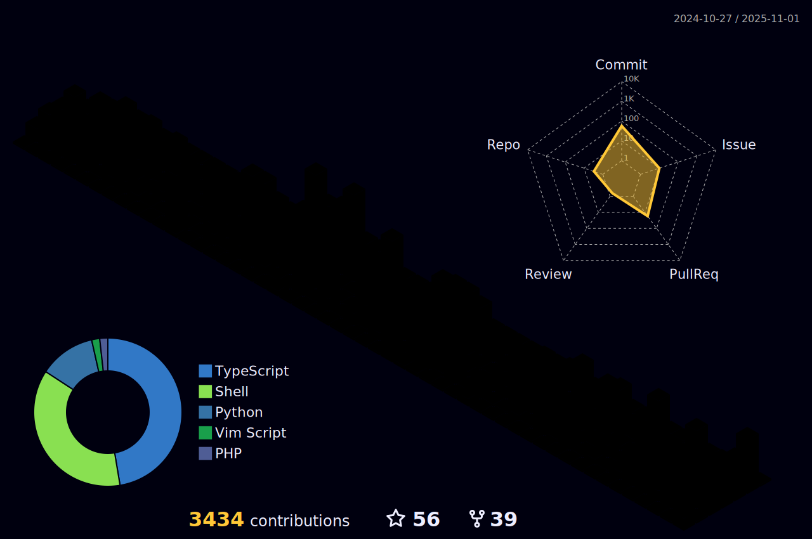

# Welcome to My GitHub Profile! 👋

Hi, I'm Oliver, a Full Stack Developer at [novu](https://novu.ch) in Bern, 🇨🇭. My current focus is on projects utilizing Laravel, Statamic CMS, and Vue.js (specifically Nuxt.js). I'm also actively exploring Kubernetes and related technologies, broadening my skills in cloud-native development.

## Contributions

(Just a note - I'm not familiar with 'Smarty'. Github is just not able to detect Yaml in Helm Charts correctly 😆.)

